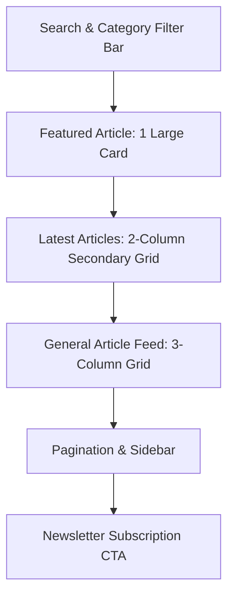

This is the **Master Structural Blueprint for the Blog Page (`/blog`) and Individual Post Page (`/blog/[slug])** based on the technical specifications in your document.

---

### **DOCUMENT 1: BLOG LISTING PAGE (`/blog`)**

**Objective:** To serve as a high-traffic content hub for AI insights, categorized for easy navigation.

#### **I. Design System & Typography**
* **Colors:**
    * **Backgrounds:** Alternating **White (`#FFFFFF`)** and **Light Gray (`#F5F5F5`)**.
    * **Primary Blue (`#0099CC`)**: Used for category badges and "Read More" links.
    * **Deep Navy (`#003366`)**: Used for Post Titles and Header text.
* **Fonts & Sizes:**
    * **Main Header (H1):** 48px, Bold, Deep Navy.
    * **Post Titles (H3):** 24px, Semi-bold, Deep Navy.
    * **Body Excerpts:** 16px, Dark Gray, 1.6 line height.

#### **II. Page Architecture**

#### **III. Section Specifications**
1.  **Header & Filter Bar:**
    * **Headline:** "Blog & Insights" (Deep Navy).
    * **Functionality:** A horizontal bar with a Search Input (left) and Category Filters (right: All, Technology, Case Studies, Company News).
2.  **Featured Article Section:**
    * **Layout:** One large horizontal card (100% width).
    * **Content:** Large placeholder image (Left), Category badge, Title, 3-line excerpt, and "Read More" button (Right).
3.  **Articles Grid:**
    * **Layout:** 3-column grid (Desktop), 1-column (Mobile).
    * **Card Anatomy:**
        * **Top:** Placeholder image with a hover "zoom" effect.
        * **Middle:** Color-coded category badge (e.g., Blue for Tech, Orange for News).
        * **Bottom:** H3 Title (Deep Navy), Date, and "5 min read" estimate.
4.  **Sidebar (Desktop Only):**
    * **Content:** "Recent Posts" list and a "Search by Tag" cloud.

---

### **DOCUMENT 2: INDIVIDUAL BLOG POST PAGE (`/blog/[slug]`)**

**Objective:** To provide a deep-reading experience with high readability and easy social sharing.

#### **I. Layout Constraints**
* **Reading Width:** Central column limited to **700px** for optimal eye tracking.
* **Spacing:** Large vertical margins (40px) between paragraphs and headers.

#### **II. Section Specifications**
1.  **Article Header:**
    * **H1 Title:** "JavaScript Engine Explained" (or specific post title from doc).
    * **Metadata Row:** Author Avatar, Author Name, Date Published, and Social Share Icons (LinkedIn, X, Link-copy).
    * **Hero Image:** Full-width placeholder image below the title.
2.  **Main Content Body:**
    * **H2 Headers:** 32px, Deep Navy.
    * **H3 Headers:** 24px, Deep Navy.
    * **Blockquotes:** 1px Primary Blue left border with italicized text.
    * **Images:** Placeholders with centered captions below in 14px Dark Gray.
3.  **Article Footer:**
    * **Author Bio Box:** Light Gray background, small avatar, and 2-line professional bio.
    * **Related Posts:** A "You Might Also Like" section featuring 3 smaller article cards.
4.  **Sticky Sidebar (Right Side):**
    * **Table of Contents:** Automated links that highlight the current section as the user scrolls.
