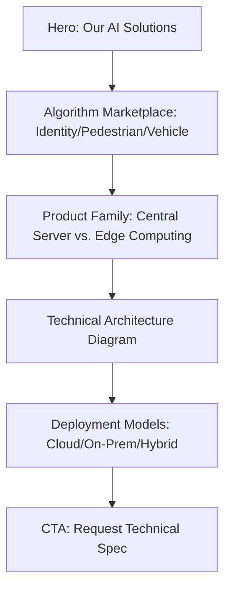
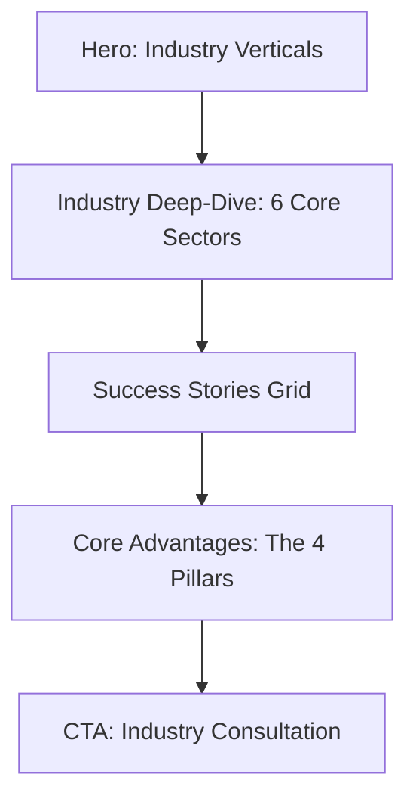

This is the **Master Structural Blueprint for the Solutions and Industries pages**. These are the "Product" and "Application" engines of the website, designed to convert technical interest into business inquiries.

---

### **1. SOLUTIONS PAGE BLUEPRINT (`/solutions`)**
**Goal:** To categorize 60+ AI algorithms and hardware into digestible tiers (Server vs. Edge).

#### **Visual Strategy & Guidelines**
* **Theme:** High-Tech & Schematic. Use more **Deep Navy (`#003366`)** and **Light Sky Blue (`#E6F2FF`)** for a "laboratory" feel.
* **Typography:** Use Mono-spaced fonts for technical specs or algorithm names to differentiate from marketing copy.

#### **Page Architecture**

#### **Section Specifications**
1.  **Hero Header:** * **Headline:** "AI Solutions: Redefining Visual Intelligence."
    * **Sub-headline:** "From high-performance servers to ultra-compact edge devices."
2.  **The Algorithm Marketplace:** * **Layout:** Tabbed Interface (Identity | Pedestrian | Vehicle | General).
    * **Content:** A searchable grid of "Algorithm Cards." Each card has a small icon, the name (e.g., "MVT-Face-Identity"), and a "View Use Case" link.
3.  **Product Family (Hardware):** * **Layout:** 2-Column Comparison.
    * **Column A (Central Server):** Focus on "Structuring Engines" for heavy data lifting.
    * **Column B (Edge Devices):** Categorized into "Small, Medium, and Large boxes."
4.  **Technical Architecture:** * **Visual:** A 4-layer stacked diagram: 1. Resource Layer -> 2. Compute Layer -> 3. Platform Layer -> 4. Application Layer.
5.  **Deployment Options:** * **Layout:** 3-Column "Feature List."
    * **Content:** Detailed specs for Cloud, On-Premise, and Hybrid integration.

---

### **2. INDUSTRIES PAGE BLUEPRINT (`/industries`)**
**Goal:** To show the "Real World" application of the tech. This page is more visual and "human-centric."

#### **Visual Strategy & Guidelines**
* **Theme:** Environmental & Practical. Use photography of real locations (Parks, Campuses, Gas Stations).
* **Accent:** Use **Orange/Red (`#FF6633`)** for "Problem/Solution" callouts to draw the eye to pain points solved.

#### **Page Architecture**

#### **Section Specifications**
1.  **Hero Header:** * **Headline:** "Intelligence for Every Environment."
    * **Background:** A montage of a Smart City and a Smart Factory.
2.  **The "Big Six" Industry Sections:** * **Layout:** Alternating side-by-side blocks (Image Left/Text Right, then Image Right/Text Left).
    * **The Six Sectors:** 1. **Smart Community:** Security and resident services.
        2. **Smart Campus:** Education safety and resource management.
        3. **Smart Construction Site:** Safety compliance (helmets, restricted areas).
        4. **Smart Gas Station:** Fire detection and vehicle flow.
        5. **Smart Branch/Outlet:** Retail analytics and VIP recognition.
        6. **Smart Park:** Environmental monitoring and visitor flow.
3.  **Success Stories Preview:** * **Layout:** 3-Card Grid.
    * **Card Anatomy:** Industry Tag (Primary Blue), High-impact metric (e.g., "30% Efficiency Gain"), and a "Read Case Study" button.
4.  **Core Advantages (The 4 Pillars):** * **Layout:** 4-Column Icon Row.
    * **Icons:** * **Linux-Compatible:** Focus on flexibility.
        * **High Efficiency:** Focus on the MVT model speed.
        * **Ultra-Simple:** Focus on the "No-Code" configuration.
        * **Reliable:** Focus on 20+ years of stability.

---

### **3. Master Palette & UI Rules (For Designers)**
| Component | Color/Style | Developer/Designer Rule |
| :--- | :--- | :--- |
| **Borders** | `#F5F5F5` | Use 1px solid borders for all product cards. |
| **Icons** | Dual-Tone | Use **Primary Blue** for the main icon body and **Deep Navy** for accents. |
| **Tables** | Alternating Rows | Background rows should alternate between White and `#F5F5F5`. |
| **Hover State** | Glow Effect | Cards should have a subtle box-shadow and a `#0099CC` border-bottom on hover. |

