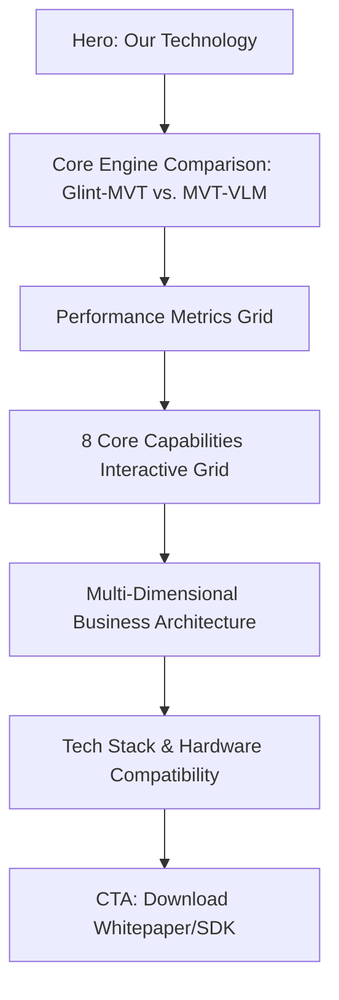
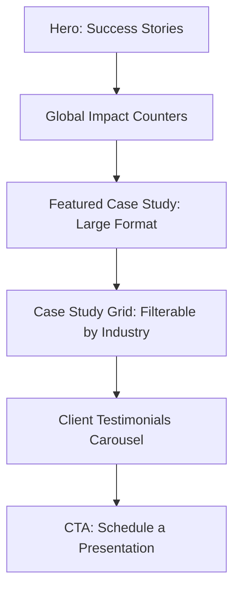
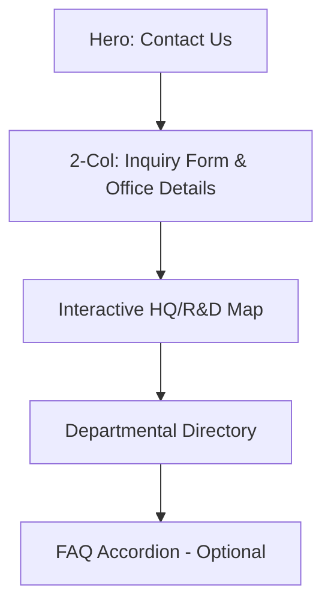

Here are the separate, detailed Master Blueprints for the **Technology**, **Success Stories**, and **Contact** pages. You can copy and paste these individually for your design and development teams.

---

### **DOCUMENT 1: MASTER BLUEPRINT – TECHNOLOGY PAGE (`/technology`)**

**Objective:** To establish technical authority by detailing the proprietary AI engines (Glint-MVT & MVT-VLM) and the underlying business architecture.

#### **I. Design System & Visual Logic**
* **Theme:** "Future-Tech Schematic." Use semi-transparent layers and "Glow" effects on technical diagrams.
* **Primary Colors:** **Deep Navy (#003366)** for containers and **Primary Blue (#0099CC)** for data visualizations.
* **Typography:** Bold H2s for performance metrics; clean body text for architectural descriptions.

#### **II. Page Architecture**

#### **III. Section-by-Section Content**
1.  **Hero Section:** * **Headline:** "The Core of Visual Intelligence."
    * **Visual:** Abstract neural network background with 40% Deep Navy overlay.
2.  **Core Technology Engines:**
    * **Layout:** Two-column deep dive.
    * **Glint-MVT:** Detail the Multi-Vision Transformer and its efficiency.
    * **MVT-VLM:** Detail the Vision-Language Model and its "understanding" capabilities.
3.  **Performance Metrics (The "Proof" Section):**
    * **Layout:** High-impact metric cards.
    * **Data:** 10x reduction in training data | 75% development time savings | >95% accuracy.
4.  **Business Architecture Diagram:**
    * **Visual:** A technical flow diagram showing the **Resource Layer** (Input) $\rightarrow$ **Compute Layer** (Parsing) $\rightarrow$ **Platform Layer** (Big Data) $\rightarrow$ **Application Layer** (Output).
5.  **Technology Stack Accordion:**
    * **Content:** List supported frameworks (Nvidia, Atlas, Linux) and integration APIs.

---

### **DOCUMENT 2: MASTER BLUEPRINT – SUCCESS STORIES (`/success-stories`)**

**Objective:** To provide social proof through data-backed case studies across all industry verticals.

#### **I. Design System & Visual Logic**
* **Theme:** "Proven Results." Use a clean, editorial layout with high-impact photography.
* **Primary Colors:** **White (#FFFFFF)** backgrounds with **Primary Blue (#0099CC)** accents for data points.

#### **II. Page Architecture**

#### **III. Section-by-Section Content**
1.  **Hero Section:**
    * **Headline:** "Real-World Impact."
    * **Sub-headline:** "Over 200+ successful AI deployments across 100+ cities."
2.  **Global Impact Counters:**
    * **Layout:** Horizontal row of four stats: 200+ Projects | 100+ Cities | 300k+ Connected Cameras | 20+ Years.
3.  **Featured Case Study:**
    * **Layout:** Full-width section with a "Challenge vs. Solution" breakdown.
    * **Focus:** Choose a high-profile "Urban Public Safety" or "Financial Intelligence" story.
4.  **Filterable Case Study Grid:**
    * **UI:** Buttons to filter by [Smart Community], [Smart Campus], [Industrial], etc.
    * **Card Anatomy:** Image, Industry Tag, Short Summary, and a "Result Highlight" (e.g., "30% Safety Increase").
5.  **Testimonials Section:**
    * **Layout:** Clean carousel with client quotes, company logos, and titles.

---

### **DOCUMENT 3: MASTER BLUEPRINT – CONTACT PAGE (`/contact`)**

**Objective:** To facilitate lead generation and provide clear access to global R&D and support hubs.

#### **I. Design System & Visual Logic**
* **Theme:** "Accessible & Global." Clean, high-contrast, and mobile-optimized.
* **Primary Colors:** **Light Gray (#F5F5F5)** for form fields and **Deep Navy (#003366)** for text. **Orange/Red (#FF6633)** for the "Submit" button.

#### **II. Page Architecture**

#### **III. Section-by-Section Content**
1.  **Hero Section:**
    * **Headline:** "Let’s Build the Future Together."
    * **Breadcrumbs:** `Home > Contact`.
2.  **The Inquiry Form (Left Column):**
    * **Fields:** Name, Email, Country, Subject (Dropdown: Sales, Support, Careers, Partnerships), Message (Min 10 chars).
    * **Design Rule:** Use real-time validation (green check for valid, red for error).
3.  **Contact Information (Right Column):**
    * **Headquarters:** Beijing address and phone.
    * **R&D Hubs:** Mention Nanjing, Chengdu, Hangzhou, and Wuhan.
    * **Emails:** Dedicated addresses for `Sales@`, `Support@`, and `HR@`.
4.  **Global Map:**
    * **Visual:** A secondary world map or regional map showing specific office pins for localized support.
5.  **Departmental Directory:**
    * **Layout:** Clean list or grid showing which department to contact for specific needs (e.g., "Technical Support" vs "Media Inquiries").

---

### **Final Directives for the UI Team**
* **Technology Page:** Use **SVG graphics** for the architecture diagrams so they remain sharp on high-DPI screens.
* **Success Stories:** Every card must have a clear "Read More" button that links to a dedicated post.
* **Contact Page:** The form must be **sticky-label** style (labels move up when the user types) for a modern feel.