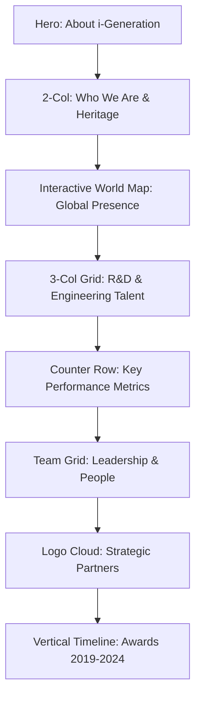

This is the **Master Structural Blueprint for the "About Us" Page (`/about`)**. This document provides the exact technical specifications, content hierarchy, and design constraints required for your UI/UX team to begin development.

---

### **1. Visual Identity & Design Guidelines**
* **Core Palette:** * **Primary Blue (`#0099CC`)**: Used for sub-headers and active icons.
    * **Deep Navy (`#003366`)**: Used for main headlines and high-authority text.
    * **Light Gray (`#F5F5F5`)**: Background for alternating sections to prevent "scroll fatigue."
    * **Orange/Red Accent (`#FF6633`)**: Reserved for "View Careers" or "Join Us" buttons.
* **Typography:** Large, bold headlines (48px) with clean, high-readability body text (16px) using 1.6x line spacing.

---

### **2. Page Component Architecture**

---

### **3. Detailed Section Specifications**

#### **Section 1: Hero Header**
* **Background:** A high-resolution image of the corporate headquarters or an abstract "Global Innovation" graphic with a Deep Navy gradient overlay.
* **Breadcrumbs:** `Home > About Us` (Small, White, 14px).
* **Headline:** "About i-Generation" (Bold, White, 48px).

#### **Section 2: Company Profile ("Who We Are")**
* **Layout:** 60/40 Split Layout.
* **Content (Left):** * **Headline:** "Who We Are"
    * **Focus:** Detail the 2001 establishment and the **20+ years of expertise** spanning IT, Telecommunications, Renewable Energy, and Vehicles.
    * **Values:** 3 specific icons representing *Innovation, Reliability, and Partnership*.
* **Visual (Right):** A high-quality team photo or a "20 Years of Excellence" circular graphic badge.

#### **Section 3: Global Presence (Interactive Map)**
* **Visual:** An interactive World Map SVG. 
* **Map Color:** Light Sky Blue (`#E6F2FF`) with Deep Navy borders.
* **Target Regions:** Pulse markers on China, Japan, South Korea, Singapore, Malaysia, Thailand, Philippines, Laos, Vietnam, Sri Lanka, and India.
* **Data Point:** A floating card indicating **"Serving 12+ Countries"**.

#### **Section 4: R&D Capabilities**
* **Layout:** Three-column icon grid.
* **Key Data to Highlight:**
    * **The Team:** Over 60% of the workforce are engineers/researchers.
    * **Infrastructure:** Description of high-performance computing labs.
    * **Focus:** Visual AI and Vision-Language Model (VLM) research.
* **Background:** Light Gray (`#F5F5F5`).

#### **Section 5: Company Statistics (The "Trust" Row)**
* **Layout:** A horizontal strip of 5 "Counter" elements that animate on scroll:
    * **25+** Years in Business
    * **5** R&D Centers
    * **12+** Countries Served
    * **60+** AI Algorithms
    * **300k+** Connected Devices

#### **Section 6: Leadership Team (Optional/Grid)**
* **Layout:** 4-Column Grid.
* **Card Anatomy:** Square headshot (grayscale, turns to color on hover), Name (Deep Navy), Title (Primary Blue), and a brief 2-line bio.

#### **Section 7: Strategic Partnerships**
* **Layout:** Multi-row logo cloud.
* **Styling:** Grayscale logos with a 0.7 opacity; transition to full color on hover.
* **Headline:** "Collaborating with Industry Leaders."

#### **Section 8: Awards Timeline (2019-2024)**
* **Layout:** Vertical "Zig-Zag" timeline or a horizontal slider.
* **Content:** Display major industry awards (extracted from the specification) by year. Each node includes the award badge and a 1-sentence description of the win.

---

### **4. Developer Checklist & Interactions**
* **Scroll Reveal:** Use "Fade-in Up" animations for the R&D cards and Statistics.
* **Map Interaction:** Clicking a region marker on the map should display a small tooltip with the specific services provided in that country.
* **Navigation:** Ensure the sticky header remains visible but transitions from transparent to solid Deep Navy or White upon leaving the Hero section.
* **Performance:** All award badges and logos must be exported as SVGs to maintain crispness at all zoom levels.